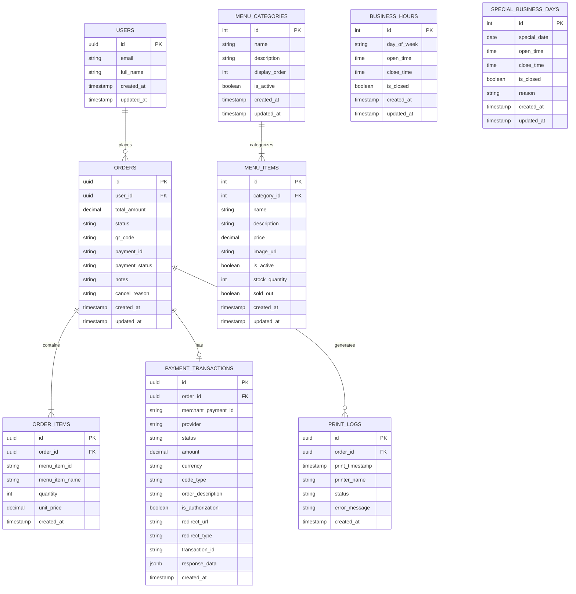

```mermaid
erDiagram
    %% Supabase (認証・トランザクション関連)
    USERS ||--o{ ORDERS : places
    USERS {
        uuid id PK
        string email
        string full_name
        timestamp created_at
        timestamp updated_at
    }
    
    ORDERS ||--|{ ORDER_ITEMS : contains
    ORDERS {
        uuid id PK
        uuid user_id FK
        decimal total_amount
        string status
        string qr_code
        string payment_id
        string payment_status
        string notes
        string cancel_reason
        timestamp created_at
        timestamp updated_at
    }
    
    ORDER_ITEMS {
        uuid id PK
        uuid order_id FK
        string menu_item_id
        string menu_item_name
        int quantity
        decimal unit_price
        timestamp created_at
    }
    
    PAYMENT_TRANSACTIONS {
        uuid id PK
        uuid order_id FK
        string merchant_payment_id
        string provider
        string status
        decimal amount
        string currency
        string code_type
        string order_description
        boolean is_authorization
        string redirect_url
        string redirect_type
        string transaction_id
        jsonb response_data
        timestamp created_at
    }
    
    ORDERS ||--o| PAYMENT_TRANSACTIONS : has
    
    PRINT_LOGS {
        uuid id PK
        uuid order_id FK
        timestamp print_timestamp
        string printer_name
        string status
        string error_message
        timestamp created_at
    }
    
    ORDERS ||--o{ PRINT_LOGS : generates
    
    %% Strapi (コンテンツ関連)
    MENU_CATEGORIES ||--|{ MENU_ITEMS : categorizes
    MENU_CATEGORIES {
        int id PK
        string name
        string description
        int display_order
        boolean is_active
        timestamp created_at
        timestamp updated_at
    }
    
    MENU_ITEMS {
        int id PK
        int category_id FK
        string name
        string description
        decimal price
        string image_url
        boolean is_active
        int stock_quantity
        boolean sold_out
        timestamp created_at
        timestamp updated_at
    }
    
    BUSINESS_HOURS {
        int id PK
        string day_of_week
        time open_time
        time close_time
        boolean is_closed
        timestamp created_at
        timestamp updated_at
    }
    
    SPECIAL_BUSINESS_DAYS {
        int id PK
        date special_date
        time open_time
        time close_time
        boolean is_closed
        string reason
        timestamp created_at
        timestamp updated_at
    }
```